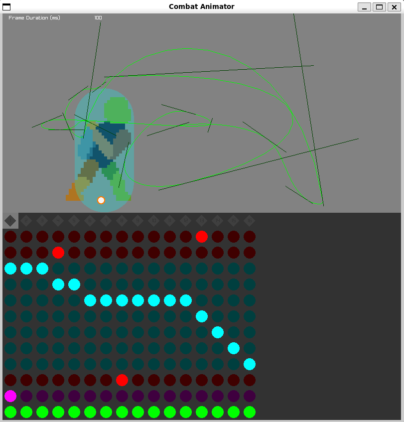

This is a simple, game engine-agnostic tool for assigning hitbox and hurtbox data to sprite animations.
I do not recommend this for general usage, as it is a personal tool for my game.
As such, this readme may not be up-to-date.

### Usage
"cac [file].png": Edit the metadata for the given file. If no metadata exists, create it and edit that. Metadata is stored in a .json file with the same name as the image file.

"cac -u": Update all metadata files in the current directory and its subdirectories to the latest metadata version.

|           Action            |            Key             |
|:---------------------------:|:--------------------------:|
|            Save             |          Ctrl + S          |
|            Undo             |          Ctrl + Z          |
|            Redo             |      Ctrl + Shift + Z      |
|             Pan             |     Left Mouse Button      |
|            Zoom             |        Mouse Wheel         |
|          Add frame          |          Alt + N           |
|        Remove frame         |      Alt + Backspace       |
| Enter text / Play animation |           Enter            |
|         New circle          |          Ctrl + 1          |
|         New square          |          Ctrl + 2          |
|        New rectangle        |          Ctrl + 3          |
|      New hurtbox layer      |       New shape + H        |
|      New hitbox layer       |       New shape + N        |
|      New metadata layer     |         Ctrl + M           |
|      New bezier layer       |         Ctrl + B           |
|        Remove layer         |      Ctrl + Backspace      |
|    Move through timeline    |         Arrow Keys         |
|    Toggle timeline value    |         Space Bar          |

## Building:
I only know it works 100% in the current OS I'm developing in.
It might work for others as I've gone from Linux to Macos to Windows. Currently on Windows.

### Setup

#### Windows
Install https://github.com/skeeto/w64devkit (MinGW) and make sure it is in the PATH.

#### MacOS
Install clang via XCode.

### Compilation
Run make in the src directory as an admin. The executable will be in the build directory.
You run it as an admin so it is copied into a directory where it can be run from the terminal.
C:/Windows/cac.exe for Windows and /usr/local/bin for MacOS and Linux.
